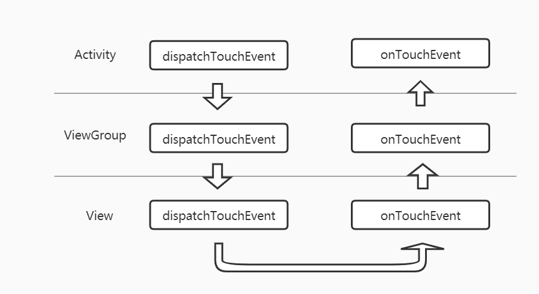

# 3个方法和3类角色

|          |                         | Activity | ViewGroup | View |
| :------: | :---------------------: | :------: | :-------: | :--: |
| 分发事件 |  dispatchTouchEvent()   |    √     |     √     |  √   |
| 拦截事件 | onInterceptTouchEvent() |    ×     |     √     |  ×   |
| 消费事件 |     onTouchEvent()      |    √     |     √     |  √   |

# 事件传递流程

 

- 事件首先由Activity接收，调用事件分发方法开始从上往下传递：从Activity的dispatchTouchEvent传到ViewGroup的dispatchTouchEvent再传到View的dispatchTouchEvent，然后调用事件消费方法开始从下往上传递，传到View的onTouchEvent传到ViewGroup的onTouchEvent再传到Activity的onTouchEvent

- 如果事件在某一层被消费掉就不会继续向上传
- ViewGroup层可以拦截事件，拦截后不会继续向下分发，即不会再调用下一层的dispatchTouchEvent方法

# 事件冲突处理

如:两个ViewPager嵌套，左右滑动的时候不知道是滑哪一个

1. 外部拦截法

   外层ViewPager通过条件判断是否调用onInterceptTouchEvent拦截事件

2. 内部拦截法

   内层ViewPager通过条件判断是否调用getParent.requestDisallowInterceptTouchEvent请求父布局拦截事件

# onTouch事件与onClick事件冲突原因

- onClick事件在onTouchEvent处理UP事件时调用
- onTouch事件在onTouchEvent之前调用
- onTouch的返回值决定onTouchEvent是否会被调用
结论:当onTouch返回true，onTouchEvent不会被调用，所以onClick也不会被调用

   

   

   

   