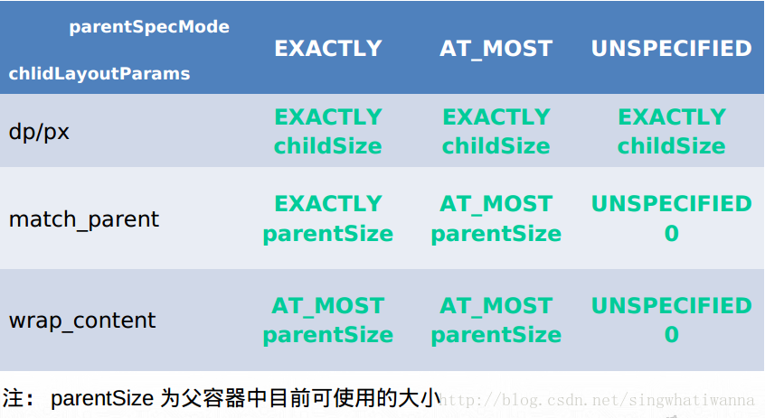

# 两个类型三个方法

|          |           | View | ViewGroup |
| :------: | :-------: | :--: | :-------: |
| 测量自身 | onMeasure |  √   |     √     |
| 摆放孩子 | onLayout  |      |     √     |
| 绘制自身 |  onDraw   |  √   |     √     |

- 在Activity.onResume()之前 ViewTree(视图树)处于初始化阶段，onResume()后实例化ViewRootImpl，将ViewRootImpl设置为ViewTree(视图树)的根并调用ViewRootImpl的requestLayout()方法开始测量、摆放、绘制三大流程，从而将布局显示到屏幕上
- ViewRootImpl会对View的更新操作进行线程效验，如果ViewRootImpl在主线程实例化，那么子线程对View的更新就会抛异常
- ViewGroup的onDraw只有在绘制自身内容的时候才会被调用，绘制子View不会被调用，子View的绘制通过调用child.onDraw()(如线性布局的分割线)

# 测量规则 01:27:41

|   规则名    |  描述  |                举例                |
|:-----------:|:------:|:---------------------------------:|
|   EXACTLY   | 精确值 |    10dp、20px、MATCH_PARENT(-1)    |
|   AT_MOST   | 最大值 | MATCH_PARENT(-1)、WRAP_CONTENT(-2) |
| UNSPECIFIED | 不确定 |    一般是系统滑动控件,如ListView    |

public static int getChildMeasureSpec(int spec, int padding, int childDimension)

子控件是根据父控件的测量规则和自己的属性来确定自已的尺寸和测量规则，如果自身为AT_MOST、UNSPECIFIED还需要遍历子控件来计算自身宽高

 

#
MeasureSpec = specMode + specSize
测量宽高
摆放宽高

父View可能多次measure的子View 如: RelativeLayout、FrameLayout  实例化要在onMeasure里进行重置
测量判断子View是否为Gone
摆放加上子View的margin
对齐

ViewPager设置warp_content无效的原因: 先设置自身宽高(设置为getDefaultSize)再测量孩子,
LayoutInflater
测量孩子:
- measureChild : 不处理子View的margin
- measureChildWithMargins : 处理子View的margin
