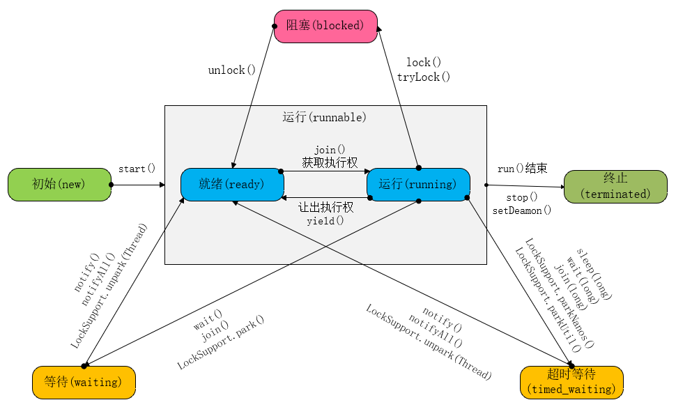

# cpu核心数与线程数的关系
在以前cpu一个核心就是一个线程,现在使用了超线程技术一核心对应两个线程,如4核8线程cpu.JDK提供了api获取cup的逻辑核心数.
```
int count = Runtime.getRuntime().availableProcessors()      //4核8线程cup，count=8
```

# 进程与线程之间的关系
- 进程 : 操作系统所管理的最小单元,一个系统里至少要有一个进程.每个进程拥有独立的内存单元.
- 线程 : CPU调度的最小单元,一个进程里至少要有一个线程.同一个进程里的多个线程共享内存.

# Java中线程的优先级
Java无法指定CPU去执行某个线程,得    通过C语言调用内核api才可以.Java的线程优先级不可靠,因为Java的线程优先级有10级,而操作系统可能只有2~3级,此时两边对应不上.

# 线程的生命周期


Java中线程的状态分为6种 :
1. 初始(new) : 新建了线程对象,但还没有调用start()方法
2. 运行(runnable) : Java中将就绪(ready)和运行中(running)两种合称为"运行".线程start()方法调用后就处于可运行线程池中,等待获取cpu的使用权,此时处于就绪状态(ready).就绪状态的线程获取到了cup时间片后变成运行中状态(running)
3. 阻塞(blocked) : 线程阻塞于锁
4. 等待(waiting) : 该线程需要等待其他线程做出一些特定动作(通知或中断)
5. 超时等待（timed_waiting）: 不同于等待状态,线程在到达指定时间后自行返回
6. 终于(terminated) : 线程已经执行完毕


# 线程的使用方式
Thread源码里注释说明有两种方法:
1. 继承Thread,重写run()方法.该方式无返回值
2. 实现Runnable接口,对Thread的构造传入Runnable参数
   1. 无返回值 : 直接传入Runnable参数
   2. 有返回值 : 传入FutureTack参数(FutureTask实现了Runnable接口,用FutureTask包裹Callable).实现Callable接口,对FutureTack的构造传入Callable参数,,通过FutureTack.get()获取返回值

# 线程的操作
|    方法     | 操作 | 备注                                                                                                                                                     |
|:-----------:|:----:|:--------------------------------------------------------------------------------------------------------------------------------------------------------|
|   start()   | 开启 | Thread.run()只是普通的方法调用,并不会开启线程                                                                                                              |
|   stop()    | 停止 | 已废弃,该方法为抢占式,会由于暴力关闭线程导致资源无法释放.被interrupt()方法替代                                                                               |
| interrupt() | 中断 | 该为协作式,发出中断信号申请停止线程.需要在run()中对isInterrupted()进行处理才有效.sleep()会清除中断信号并抛出InterruptedException,需要在异常捕获里再次中断才有效 |
|   join()    | 插队 | 通过该方法可以实现多个线程按顺序执行.如:在线程B中调用线程A.join(),会使线程A执行完毕后才继续执行线程B                                                          |
| setDaemon() | 守护 | 设置为守护的线程在被守护线程结束结束时也会跟着结束.调用守护线程的start()方法的线程成为被守护线程                                                               |
|   yield()   | 放弃 | 让出执行权回到就绪状态                                                                                                                                    |

# wait() 与 sleep()的区别
|  方法   | 调用对象 | 是否释放锁 |             获取执行权的条件              |
|:-------:|:-------:|:----------:|:---------------------------------------:|
| wait()  | Object  |    释放    | 由notify()或notifyAll()唤醒或等待时间结束 |
| sleep() | Thread  |   不释放   |               休眠时间结束               |

# 线程池
- 线程池的作用 : 线程的创建、销毁都需要消耗系统资源,通过线程池管理节省线程的创建、销毁开销,从而提升性能
- JDK提供了线程池核心实现类ThreadPoolExecutor
  1. 构造函数各参数含义

        |     参数名      |                  参数意义                   |
        |:---------------:|:------------------------------------------:|
        |  corePoolSize   |                 核心线程数                  |
        | maximumPoolSize |            总线程数(核心+非核心)            |
        |  keepAliveTime  |             非核心线程存活时间              |
        |      unit       |             存活时间时间单位                |
        |    workQueue    |                  任务队列                   |
        |  threadFactory  | 线程工厂 : 可用于给线程取名、设置为守护线程等 |
        |     handler     |                  拒绝策略                   |
  2. 方法介绍

        |    方法名     |                         描述                          |
        |:-------------:|:----------------------------------------------------:|
        |   execute()   |      提交不需要返回值任务,无法判断任务是否执行成功       |
        |   submit()    |          提交需要返回值任务,会返回Future对象           |
        |  shutdown()   |        设置线程池状态为shutdown,中断所有闲置线程        |
        | shutdownNow() | 设置线程池状态为stop, 尝试停止所有线程并返回所有等待任务 |
  3. 拒绝策略

        |        类名         |                     描述                      |
        |:-------------------:|:---------------------------------------------:|
        |     AbortPolicy     |            默认策略 : 直接抛出异常             |
        |  CallerRunsPolicy   |          用调用者所在的线程来执行任务           |
        | DiscardOldestPolicy | 丢弃阻塞队列中靠最前(最老)的任务，并执行当前任务 |
        |    DiscardPolicy    |                  直接丢弃任务                  |
  4. 线程池实现

        |                     |                  描述                   |              应用场景              |
        |:-------------------:|:---------------------------------------:|:----------------------------------:|
        |   FixedThreadPool   |           固定数量全核心线程池            |    任务量比较固定但耗时长的任务     |
        |  CachedThreadPool   |    最大整型数的全非核心线程池,60秒存活    |       任务量大但耗时少的任务        |
        | ScheduledThreadPool | 固定数量核心、最大整型数非核心线程,0秒存活 | 执行定时任务和具体固定周期的重复任务 |
        |  SingleThreadPool   |               单核心线程池               |       多个任务顺序执行的场景        |

  5. 线程池的工作机制

        |     任务数量     |      操作      |
        |:----------------:|:-------------:|
        | 小于corePoolSize |  新建核心线程  |
        | 大于corePoolSize |  存入任务队列  |
        |   任务队列存满    | 新建非核心线程 |
        |   大于总线程数    | 使用拒绝策略  |
  6. 根据任务性质合理配置线程池

        | 任务性质  |       描述        |                   根据cpu核心数(count)配置最大线程数                    |
        |:---------:|:----------------:|:---------------------------------------------------------------------:|
        | CPU密集型 |     计算任务      |                                count+1                                |
        | IO密集型  | 磁盘操作或网络任务 |                               2*count+1                               |
        |  混合型   |   包含前两种任务   | 对比两种任务执行时间,如果相差不大,对任务进行拆分;如果相差很大,按IO密集处理 |
        - 线程读取磁盘资源,由于响应时间远远超过读取内存数据时间,系统进入页缺失状态
        - +1是为了避免页缺失导致cup有一个核心空闲
        - 尽量不要配置无界任务队列,避免OOM

# 解决多线程并发访问的三种方案
1. ThreadLocal
   - 概念 : 为每个线程提供资源副本,使用每个线程同一时间访问的并非同一个对象.比如多线程对同一个静态变量正常情况下是共享的,如果需求是每一个线程都对该变量独享,就需要用ThreadLocal对该变量拷贝一份到自己线程的独有空间
   - 实现解析 :  每个线程都有会有一个ThreadLocalMap变量用来保存副本,ThreadLocalMap的容器是Entry数组,而Entry则是一个键值对(键为ThreadLocal、值为Object)
2. CAS(Compare And Swap)
   - 概念 : 执行操作后先比较旧值,如果旧值没发生变化再替换.如果发生变化则循环重新执行操作,直到成功替换为止.
   - 存在的问题
     - 开销问题(无法解决)
     - ABA问题(可加入版本控制解决)
     - 只能保证一个共享变量的原子操作(可通过将多个变量组合到一个对象中解决)
   - jdk中相关的类

        | 更新基本类型类 |      更新数组类       |                        更新引用类型类                        |
        |:-------------:|:--------------------:|:------------------------------------------------------------:|
        | AtomicBoolean |  AtomicIntegerArray  | AtomicReference(使用对象解决只能保证一个共享变量的原子操作问题) |
        | AtomicInteger |   AtomicLongArray    |         AtomicMarkableReference(只关心版本有没有变化)         |
        |  AtomicLong   | AtomicReferenceArray |         AtomicStampedReference(还关心版本变化了几次)          |
3. synchronized
   - 概念 : 使用锁机制使变量或代码块在同一时间只能被一个线程访问
   - 实现原理 : 使用`monitorenter`和`monitorexit`指令,在编译后的同步代码块开始位置插入 `monitorenter`、结束和异常位置插入`monitorexit`

在竞争适度适中的情况下,三种方式的性能是 ThreadLocal > CAS > synchronized.
- synchronized 涉及到多线程竞争同一资源、上下文切换
- CAS 不需要上下文切换
- ThreadLocal 访问线程自身的副本,不需要竞争资源也不需要上下上下文切换


