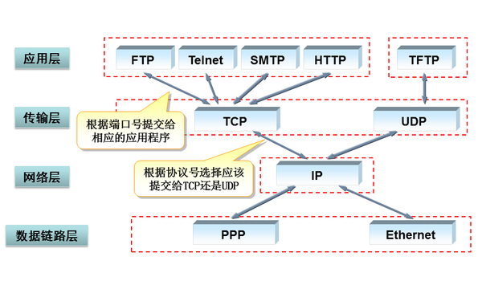

# TCP、UDP、HTTP之间的关系
 

# TCP与UDP区别
- TCP要求系统资源较多、保证数据的顺序和数据的正确性.应用场景 : 文件传输
- UDP要求系统资源较少、不保证数据顺序可能存在会丢包.面向无连接的通讯协议、不需要接收方确认所以不可靠、不需要建立连接所以传输快但是容易丢失数据.应用场景 : 视频通话

# TCP的3次握手4次挥手
- 3次握手(建立连接) :
  1. 客户端->服务器  我想跟你谈恋爱
  2. 服务器->客户端  我知道了你喜欢我，我愿意跟你谈恋爱,如果你知道了我愿意请告诉我
  3. 客户端->服务器  我知道了你愿意

  至此恋爱关系成立(建立连接成功)

- 4次挥手(断开连接) :
  1. 客户端->服务器  我没数据要发给你了申请断开连接，如果你还有数据要发给我可以继续发送
  2. 服务器->客户端  我知道你想断开了，等我准备好给你消息
  3. 服务器->客户端  我准备完成了，我们断开连接吧
  4. 客户端->服务器  我知道你准备好了，那我断开了

  第4步后服务器可以选择继续答复客户端，也可以不答复，如果客户端在等待一定时间后没收到答复就自行关闭连接

# 一次完整Http请求的过程 2.1 00:49:44
1. 建立TCP连接
2. 客户端->服务器 发送请求行
3. 客户端->服务器 发送请求头
4. 服务器->客户端 应答,发送响应行
5. 服务器->客户端 发送响应头
6. 服务器->客户端 发送响应体
7. 关闭TCP连接

# Http协议里的请求和响应
- 请求:
  1. 请求行: 请求类型、Http版本
  2. 请求头：键值对信息
  3. 空行：请求头后面必须加一空行
  4. 请求体：请求数据
- 响应：
  1. 状态行：状态码、状态消息、Http版本
  2. 响应头：键值对信息
  3. 空行：响应头后面必须加一空行
  4. 响应体：响应数据
- 响应码 :
  1. 2XX(成功)
  2. 3XX(重定向)
  3. 4XX(请求错误)
  4. 5XX(服务器错误)
- 常用头信息 2.1 01：04
- 缓存策略 2.2 00:12

# Http版本区别 3.1 00:47:00

# Http默认使用80商品 Https默认使用443端口   2.2  00:55:36 http风险

# 对称加密与非对称加密

# Https认证过程 3.1 00:42:00(单向认证)  3.1 00:44:30(双向认证)

# Restful 3.1 00:55:14