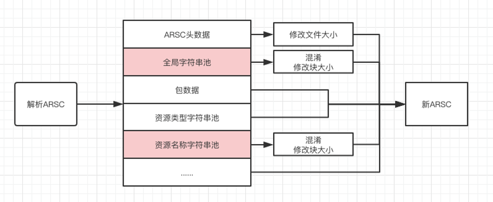

# Apk的打包流程
1. aapt阶段(打包资源文件)
   - 合并Maifest、合并Resources、合并Assets 打包资源生成 R.java、resources.arsc(索引表)和res文件(res/raw、assets、pic文件会保持原样，其他的会进行压缩)
2. aidl阶段
   - 处理.aidi文件，生成对应的java文件
3. java编译阶段
   - 编译以上java文件生成.class文件
4. dex阶段
   - 将.class文件处理生成classes.dex文件
5. apk打包
   - 打包生成apk文件
6. 签名阶段
   - 对apk进行签名,如:Debug或Release签名
7. 对齐阶段
   - 对签名后的apk进行对齐处理


# Apk的目录结构

|           目录            |  目录描述  |
|:-------------------------:|:---------:|
|          assets           | 资产文件夹 |
|            lib            | so库文件夹 |
|            res            | 资源文件夹 |
|         META-INF          | 签名文件夹 |
|           .dex            |   类代码   |
|      resources.arsc       | 资源映射表 |
| AndroidManifest.xml       |  清单文件  |


# 优化
- 动态库
  ```
  android{
    defaultConfig{
        ...
        ndk{
            abiFilters "armeabi-v7a" //只配置v7架构,微信就只配置了v7.不指定会适配所有架构,占用体积         
        }        
        ...            
    }    
  }
  ```

- 图片
  - 使用矢量图(SVG),只限用于小图标、小图片
    - AS不支持svg、psd格式的矢量图,支持的格式是vector,AS可以提供转换功能但一次只能转换一张,批量转换使用工具svg2vector-cli-1.0.0.jar
    - 5.0(api 21)之前的版本不支持矢量图,要做兼容处理,有两种方式
      1. 指定目录下生成png图片
        ```
        android{
            defaultConfig{
                ...
                generatedDensities =['hdpi','mdpi']  //指定hdpi、mdpi目录,不指定每个目录都会生成,占用体积       
                ...            
            }    
        }
        ```
      2. support支持库(需要不低于23.2版本),属性使用 "app:srcCompat" 替换 "android:src"
        ```
        android{
            defaultConfig{
                ...
                vectorDrawables.useSupportLibrary=true  //使用支持库中的VectorDrawableCompat      
                ...            
            }    
        }
        ```
  - 使用Tint着色器修改颜色,
    1. "android:tint" ,修改颜色
    2. "android:backgroundTint" ,修改背景色
    3. 选择器效果实现 : 图片选择器可以使用同一张图,给"android:tint"设置颜色选择器
  - 使用webp图片

- 移除无用资源
  1. 自动删除(高风险) : 只能全部移除无法帅选,通过菜单 Refactor - Remove Unused Resources
  2. 手自删除(Lint工具) : 可以选择性删除,通过菜单 Analyze - Run Inspection by Name

- 国际化
  ```
  android{
    defaultConfig{
        ...
        resConfigs 'en','zh-rCN'  //只适配英语、中文简体,不指定会适配所有语言,浪费体积     
        ...            
    }    
  }
  ```

- 代码混淆
  ```
  android{
    buildTypes{
      release{
         minifyEnabled true //设置为true才开启混淆,混淆会缩短字符串、剔除没用到的方法,大大增加了编译时间.只在提测时才打开
         proguardFiles getDefaultProguardFile('proguard-android-optimize.txt'), 'proguard-rules.pro'    
      }   
    }    
  }
  ```

- 资源压缩
  - 配置
    ```
    android{
        buildTypes{
          release{
             minifyEnabled true 
             shrinkResources true //只有在代码混淆开启的时候才有效       
             proguardFiles getDefaultProguardFile('proguard-android-optimize.txt'), 'proguard-rules.pro'    
          }   
        }    
    }
    ```
  - 生成res/raw/keep.xml文件,设置压缩模式、对指定资源进行保留或舍弃.keep文件构建时不会打包进apk中.
    ```
    <?xml version="1.0" encoding="utf-8"?>
    <resources xmlns:tools="http://schemas.android.com/tools"
        tools:shrinkMode="strict"
        tools:keep="@layout/use1,@layout/use2"
        tools:discard="@layout/un_use1"/>
    ```
    - shrinkMode : 有两种模式safe(包含匹配,StartWith)、strict(全量匹配,MatchCase),默认为safe模式
    - keep : 要保留的资源
    - discard : 要舍弃的资源

- 资源混淆
  - 原理 : 将打包时未压缩的资源(如png/jpg图片等)进行压缩,并更改资源映射表中的资源路径及资源名称(缩短字符改成a、b、c ...这种)
  - [微信资源混淆工具](https://github.com/shwenzhang/AndResGuard/blob/master/README.zh-cn.md)
  - 资源映射表文件分析
    - 对资源映射表进行描述的类是ResourceTypes,不同版本ResourceTypes.h的文件地址
      - https://www.androidos.net.cn/android/7.1.1_r28/xref/frameworks/base/include/androidfw/ResourceTypes.h
      - https://www.androidos.net.cn/android/8.0.0_r4/xref/frameworks/base/libs/androidfw/include/androidfw/ResourceTypes.h
    - 资源映射表结构图
    - 资源映射表修改流程  
    
  - 操作流程 :
    1. 配置需要进行强制压缩的文件格式
    2. 解压原apk,获得原APK中的文件、是否压缩表
    3. 解析ARSC文件
    4. 混淆字符,产生混淆名集合 (混淆全局字符串池中的res与资源名称字符串池，不能混淆资源类型字符串池)
    5. 制作新的ARSC文件(混淆后的)
    6. 将原apk中其他文件进行拷贝,并根据混淆修改res/目录下文件名
    7. 打包、对齐、签名
    8. 写出mapping(原资源路径与混淆后的资源路径的映射关系,方面调bug)

- 插件化  
非主要模块使用插件化加载,减小apk体积


